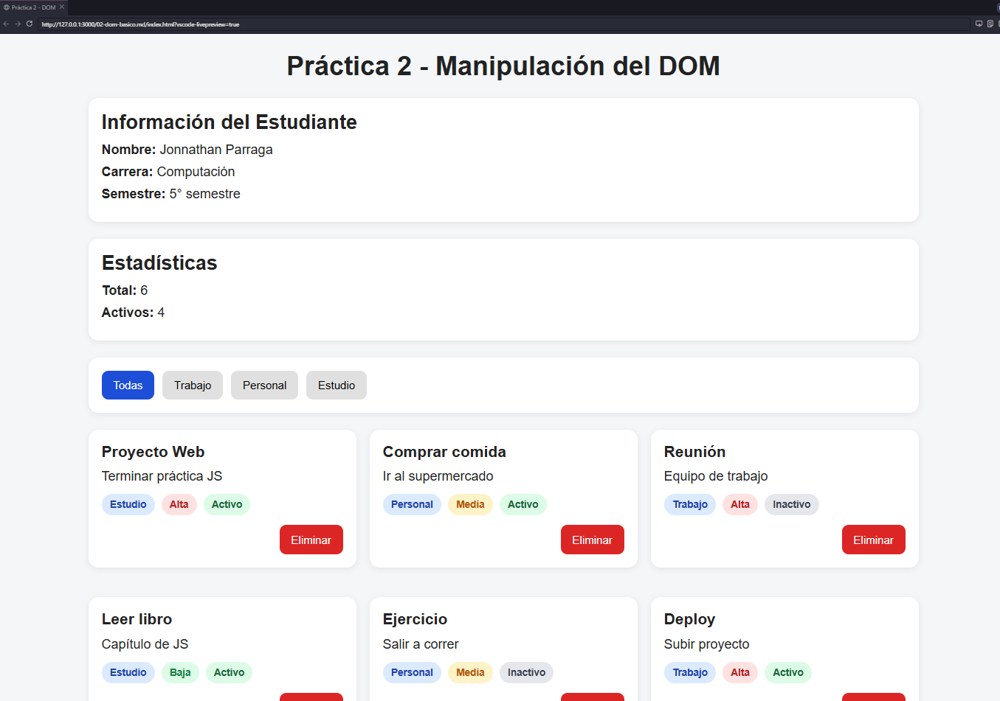
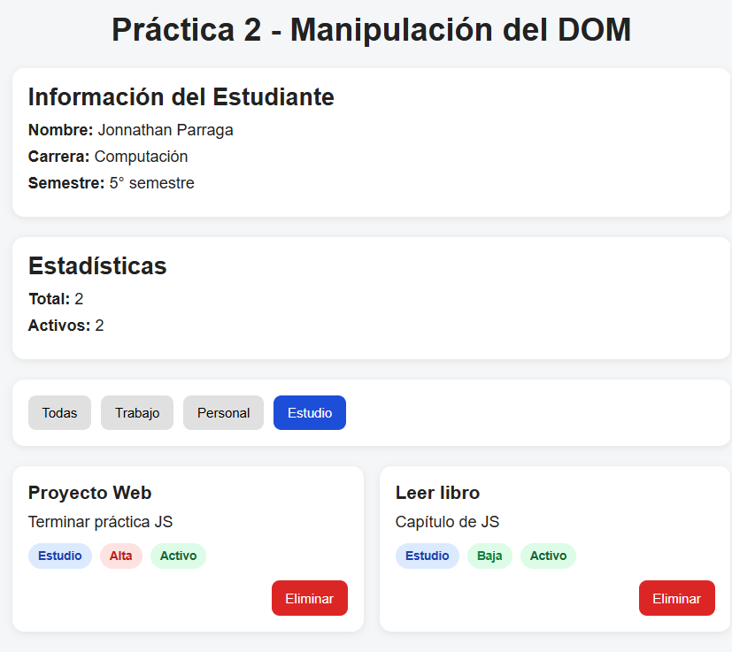
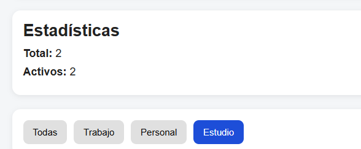
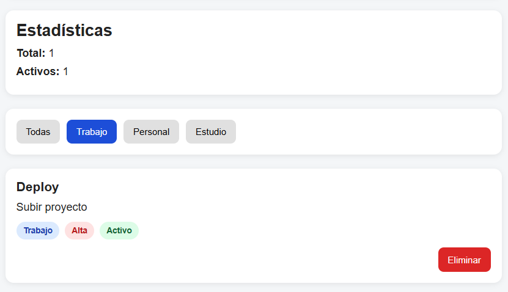
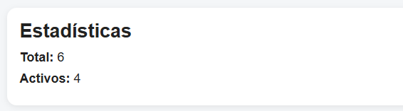

# 🧠 Práctica 2 - Manipulación del DOM

Esta aplicación web demuestra el uso de **JavaScript Vanilla** para la manipulación dinámica del Document Object Model (DOM). El proyecto permite gestionar una lista de tareas mediante el renderizado, filtrado por categorías y eliminación de nodos en tiempo real.

---

## 📂 Estructura del Proyecto

El proyecto sigue una organización modular para separar la estructura, los estilos y la lógica de negocio:

* `index.html`: Estructura semántica base y contenedores vacíos para la inyección dinámica.
* `css/styles.css`: Estilos visuales, sistema de grid/flexbox y diseño de las tarjetas.
* `js/app.js`: Lógica de programación, eventos y manipulación del DOM.
* `assets/`: Directorio destinado a la documentación visual del proyecto.

---

## 📌 Funcionalidades y Capturas de Pantalla

A continuación, se destacan los 5 puntos clave del desarrollo con sus respectivas demostraciones visuales:

### 1. Vista General y Carga Inicial
Al iniciar la aplicación, JavaScript lee el arreglo de objetos y utiliza `document.createElement` para inyectar cada tarjeta en el contenedor principal, evitando el uso de HTML estático.
```javascript
function renderizarLista(datos) {
  const contenedor = document.getElementById('contenedor-lista');
  contenedor.innerHTML = ''; 

  datos.forEach(el => {
    const card = document.createElement('div');
    card.classList.add('card');
    const titulo = document.createElement('h3');
    titulo.textContent = el.titulo;
    card.appendChild(titulo);
    contenedor.appendChild(card);
  });
```



### 2. Sistema de Filtrado Reactivo
Al hacer clic en los botones de categoría (Trabajo, Personal, Estudio), se aplica el método `.filter()` sobre los datos y se vuelve a renderizar la vista instantáneamente.

```const filtrarElementos = (categoria) => {
  const filtrados = elementos.filter(el => el.categoria === categoria);
  renderizarLista(filtrados);
};
```


### 3. Destacados del DOM (Creación de Nodos)
En lugar de inyectar strings con `innerHTML`, la aplicación construye los elementos paso a paso para mayor seguridad y control. Se usan métodos como `classList.add()` para los badges de colores.
```
const filtrarElementos = (categoria) => {
  const filtrados = elementos.filter(el => el.categoria === categoria);
  renderizarLista(filtrados);
};
```


### 4. Lógica del Botón Eliminar
Cada tarjeta generada incluye un botón de eliminación vinculado a un evento. Al hacer clic, se identifica la tarea, se utiliza .filter() para removerla de la memoria y se actualiza el DOM automáticamente.
```
function eliminarTarea(id) {
  elementos = elementos.filter(t => t.id !== id);
  renderizarLista(elementos);
  actualizarEstadisticas();
}a, se utiliza `.splice()` o `.filter()` para refunction eliminarTarea(id) {
  elementos = elementos.filter(t => t.id !== id);
  renderizarLista(elementos);
  actualizarEstadisticas();
}rla de la memoria y se actualiza el DOM.
```


### 5. Estadísticas en Tiempo Real
Un panel superior cuenta el total de tareas y las tareas activas utilizando la propiedad `.length`. Estos números se actualizan de forma automática mediante la propiedad `textContent` cada vez que ocurre un cambio en la lista.
```
const actualizarEstadisticas = () => {
  const total = elementos.length;
  document.getElementById('stats-total').textContent = total;
};
```


---

## 🛠️ Tecnologías Utilizadas

* **HTML5:** Semántica y accesibilidad.
* **CSS3:** Flexbox, variables CSS y diseño responsive.
* **JavaScript (ES6+):** Arrow functions, manipulación de arrays y eventos del DOM.

---

## 👤 Información del Estudiante

* **Nombre:** Jonnathan Parraga
* **Carrera:** Computación
* **Semestre:** 5° Semestre
* **Institución:** Universidad Politécnica Salesiana