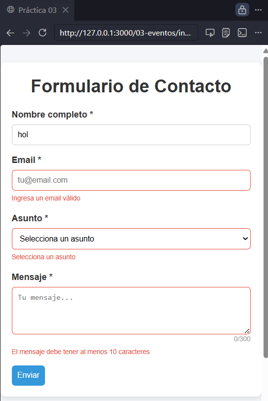
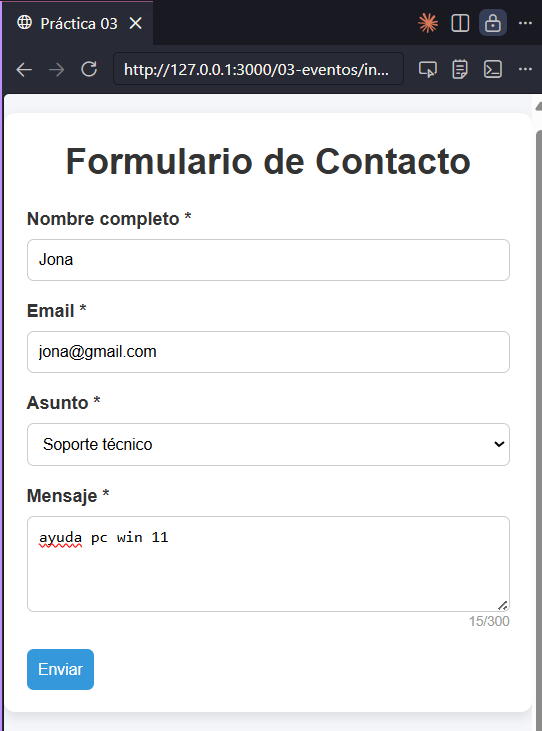
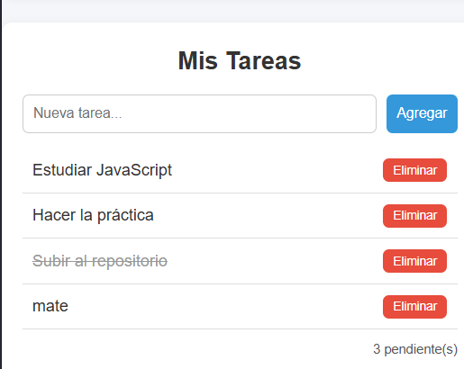
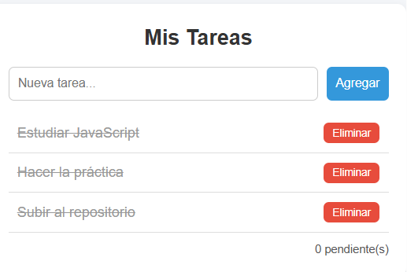

# Práctica 03 - Eventos en JavaScript

## Descripción

En esta práctica se desarrolló una aplicación web utilizando JavaScript para trabajar con eventos y manipulación del DOM.

La aplicación tiene dos partes principales:

- Un formulario de contacto con validación en tiempo real.
- Un sistema de tareas donde se pueden agregar, completar y eliminar tareas.

El objetivo fue comprender cómo funcionan los eventos en JavaScript y cómo interactuar dinámicamente con los elementos HTML.

---

## Funcionalidades

### Formulario
- Validación de campos obligatorios (nombre, email, asunto y mensaje)
- Validación de email con expresión regular
- Mensajes de error cuando el campo es inválido
- Los errores se eliminan automáticamente al escribir
- Contador de caracteres en el mensaje
- Envío del formulario solo si todos los campos son válidos
- Atajo de teclado con **Ctrl + Enter**

### Sistema de tareas
- Agregar nuevas tareas
- Marcar tareas como completadas
- Eliminar tareas
- Contador de tareas pendientes
- Agregar tareas presionando Enter
- Uso de **event delegation** (un solo evento controla toda la lista)

---

## Estructura del proyecto
/03-eventos
├── index.html
├── css/
│ └── style.css
├── js/
│ └── app.js
├── assets/
│ ├── 01-validacion.png
│ ├── 02-formulario-enviado.png
│ ├── 03-delegacion.png
│ ├── 04-contador-tareas.png
│ └── 05-tareas-completadas.png
└── README.md

## Código destacado

### Validación del formulario

```

formulario.addEventListener('submit', (e) => {
  e.preventDefault();

  const nombreValido = validarNombre();
  const emailValido = validarEmail();
  const asuntoValido = validarAsunto();
  const mensajeValido = validarMensaje();

  if (nombreValido && emailValido && asuntoValido && mensajeValido) {
    mostrarResultado();
    resetearFormulario();
    return;
  }

  if (!nombreValido) {
    inputNombre.focus();
    return;
  }

  if (!emailValido) {
    inputEmail.focus();
    return;
  }

  if (!asuntoValido) {
    selectAsunto.focus();
    return;
  }

  textMensaje.focus();
});
```
Event delegation en tareas
```
listaTareas.addEventListener('click', (e) => {
  const action = e.target.dataset.action;

  if (!action) return;

  const item = e.target.closest('li');
  if (!item || !item.dataset.id) return;

  const id = Number(item.dataset.id);

  if (action === 'eliminar') {
    tareas = tareas.filter(t => t.id !== id);
    renderizarTareas();
    return;
  }

  if (action === 'toggle') {
    const tarea = tareas.find(t => t.id === id);
    if (tarea) {
      tarea.completada = !tarea.completada;
      renderizarTareas();
    }
  }
});
```
Atajo de teclado (Ctrl + Enter)
```
document.addEventListener('keydown', (e) => {
  if (e.ctrlKey && e.key === 'Enter') {
    e.preventDefault();
    formulario.requestSubmit();
  }
});
```
Agregar tareas dinámicamente
```
function agregarTarea() {
  const texto = inputNuevaTarea.value.trim();

  if (texto === '') {
    inputNuevaTarea.focus();
    return;
  }

  tareas.push({
    id: Date.now(),
    texto,
    completada: false
  });

  inputNuevaTarea.value = '';
  renderizarTareas();
  inputNuevaTarea.focus();
}
```
## Capturas

### Validación del formulario


### Formulario enviado


### Event delegation funcionando


### Contador de tareas


### Tareas completadas


Conclusión

Esta práctica permitió entender mejor cómo funcionan los eventos en JavaScript, cómo validar formularios y cómo manipular el DOM de manera dinámica.

También se aprendió a usar event delegation, lo cual es muy útil cuando se trabaja con elementos que se crean dinámicamente.