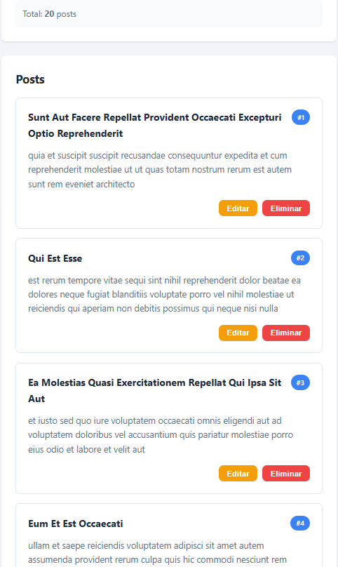
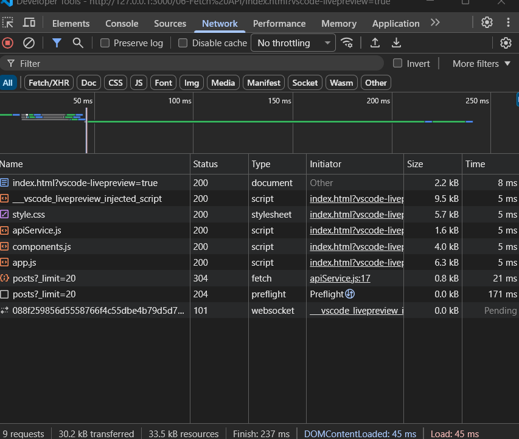

## Paso 8: Pruebas y Verificación

### 8.1 Pruebas de carga y renderizado

**Carga inicial**

- **Abrir** `index.html` en el navegador.
- **Verificar** que aparece el spinner *"Cargando posts..."*.
- **Verificar** que se cargan **20 posts** desde JSONPlaceholder.
- **Verificar** que el contador muestra `Total: 20 posts`.
- **Verificar** que cada tarjeta tiene **título**, **contenido**, **ID** y botones *Editar / Eliminar*.

**Estados visuales**

- **Verificar** que las tarjetas tienen efecto *hover* (elevación y borde azul).
- **Verificar** que los botones tienen estados *hover* activos.

---

### 8.2 Pruebas de CRUD

**Crear post (POST)**

- **Llenar** el formulario con título `Mi nuevo post` y contenido `Contenido de prueba`.
- **Click** en *Crear Post*.
- **Verificar** que el botón cambia a *Creando...*.
- **Verificar** que aparece el mensaje verde `Post #101 creado correctamente`.
- **Verificar** que el nuevo post aparece **al inicio** de la lista.
- **Verificar** que el contador aumenta a **21**.

**Editar post (PUT)**

- **Click** en *Editar* de cualquier post.
- **Verificar** que el formulario se llena con los datos del post.
- **Verificar** que el botón cambia a *Actualizar Post*.
- **Verificar** que aparece el botón *Cancelar*.
- **Modificar** el título a `Post actualizado`.
- **Click** en *Actualizar Post*.
- **Verificar** que aparece el mensaje `Post #X actualizado correctamente`.
- **Verificar** que la tarjeta se actualiza con el nuevo título.

**Cancelar edición**

- **Click** en *Editar* de un post.
- **Click** en *Cancelar*.
- **Verificar** que el formulario se limpia.
- **Verificar** que el botón vuelve a *Crear Post*.
- **Verificar** que el botón *Cancelar* se oculta.

**Eliminar post (DELETE)**

- **Click** en *Eliminar* de un post.
- **Verificar** que aparece la confirmación `¿Eliminar el post #X?`.
- **Click** en *Aceptar*.
- **Verificar** que aparece el mensaje `Post #X eliminado correctamente`.
- **Verificar** que la tarjeta desaparece de la lista.
- **Verificar** que el contador disminuye.

---

### 8.3 Pruebas de búsqueda

**Buscar por título**

- **Escribir** `qui` en el campo de búsqueda.
- **Click** en *Buscar* o presionar `Enter`.
- **Verificar** que solo aparecen posts cuyo título contenga `qui`.
- **Verificar** que el contador se actualiza.

**Buscar por contenido**

- **Escribir** `quia` en búsqueda.
- **Verificar** que filtra por **título O contenido**.

**Limpiar búsqueda**

- **Click** en *Limpiar*.
- **Verificar** que el input se vacía.
- **Verificar** que se muestran todos los posts.
- **Verificar** que el contador vuelve al total.

**Búsqueda sin resultados**

- **Escribir** `xyz123abc` (texto inexistente).
- **Verificar** que muestra el mensaje `No hay posts para mostrar`.

---

### 8.4 Pruebas técnicas (DevTools)

**Network tab**

- **Abrir** *DevTools > Network*.
- **Recargar** la página.
- **Verificar** la petición `GET https://jsonplaceholder.typicode.com/posts?_limit=20`.
- **Verificar** que el *status* es **200**.
- **Verificar** que la *Response* contiene un array de **20 posts**.

**POST request**

- **Crear** un post.
- **Buscar** en *Network* la petición `POST /posts`.
- **Verificar** los *Request Headers*: `Content-Type: application/json`.
- **Verificar** el *Request Payload* con los datos enviados.
- **Verificar** la *Response* con status **201** y el post creado.

**Manejo de errores**

- **Cambiar** temporalmente el `baseUrl` a una URL inválida en el código.
- **Recargar** la página.
- **Verificar** que muestra mensaje de error en rojo.
- **Restaurar** la URL correcta.

**Console**

- **Verificar** que no hay errores en consola.
- **Verificar** que se imprime `Error en petición:` solo cuando hay errores reales.

---

## 8. Resultados y Evidencias

### Capturas requeridas

- **Lista cargada** — Datos de la API renderizados en la página.
- **Spinner** — Estado de carga visible.
- **Crear** — Formulario enviado, nuevo item en la lista.
- **Editar** — Item modificado visible.
- **Eliminar** — Item removido.
- **Error** — Mensaje de error al fallar una petición.
- **DevTools Network** — Pestaña Network mostrando las peticiones HTTP.
- **Código** — Capturas del servicio API y componentes.

---

### Formato del Archivo de Evidencias

### 1. Datos cargados desde la API

**Descripción:** Se obtienen N registros desde la API con GET...

---

### 2. Network tab

**Descripción:** En DevTools > Network se observan los requests GET, POST...