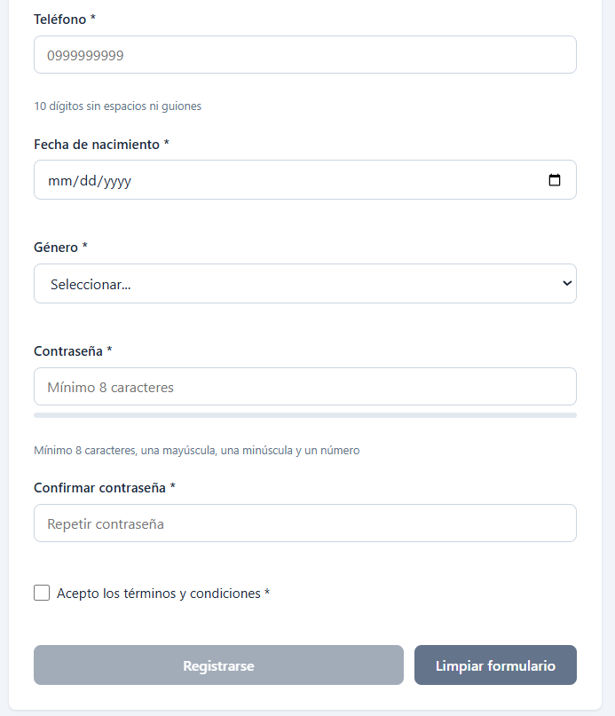
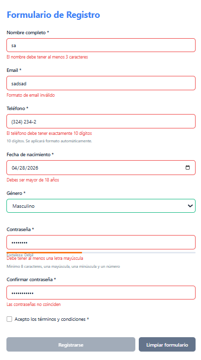
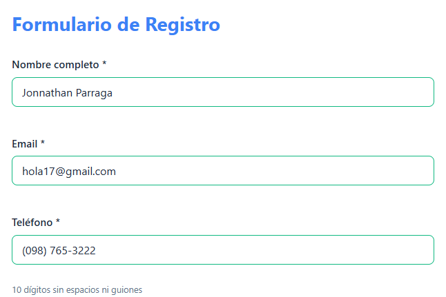
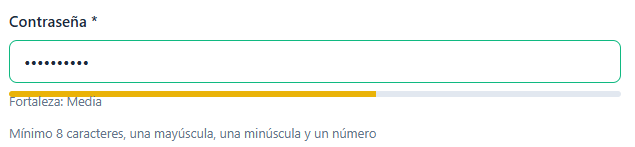
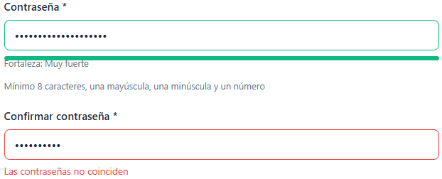
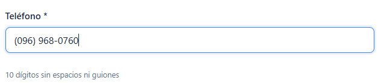
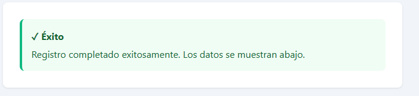
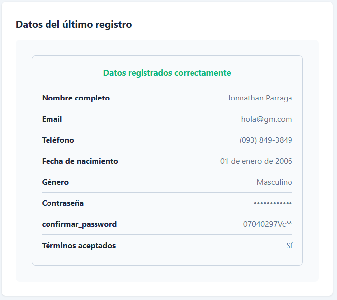
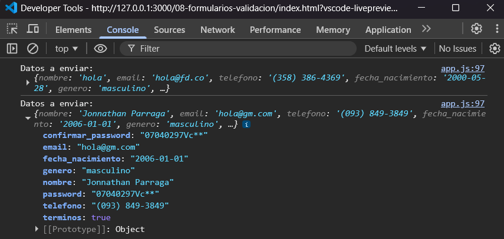

# Práctica 08 - Formularios y Validación

## 8. Resultados y Evidencias

A continuación se documentan las capturas de pantalla que evidencian el correcto funcionamiento del formulario de registro con validación en tiempo real, máscara de teléfono, indicador de fuerza de contraseña y envío con renderizado de resultados.

---

### 1. Formulario vacío con botón deshabilitado



**Descripción:** Vista inicial del formulario de registro al cargar la página. Todos los campos están vacíos y el botón *Registrarse* aparece deshabilitado hasta que se completen los campos requeridos.

---

### 2. Errores de validación



**Descripción:** Múltiples campos del formulario muestran borde rojo y mensajes de error específicos, evidenciando la validación al perder el foco (`focusout`) cuando los datos ingresados no cumplen las reglas establecidas.

---

### 3. Campos válidos



**Descripción:** Al cumplir con las condiciones planteadas de cada campo, estos se pintan de color verde en el borde.

---

### 4. Indicador de fuerza de contraseña



**Descripción:** Medidor visual que evalúa la robustez de la contraseña en tiempo real, mostrando distintos niveles (Muy débil, Débil, Media, Fuerte, Muy fuerte) según los criterios cumplidos: longitud mínima, mayúsculas, minúsculas, números y caracteres especiales.

---

### 5. Error de contraseñas no coinciden



**Descripción:** Mensaje de error en el campo *Confirmar contraseña* cuando el valor ingresado no coincide con la contraseña principal. La validación se ejecuta dinámicamente al modificar cualquiera de los dos campos.

---

### 6. Máscara de teléfono



**Descripción:** Formato automático aplicado al campo teléfono mientras el usuario escribe, transformando los 10 dígitos al patrón `(099) 999-9999`. Los caracteres no numéricos son ignorados gracias a la función `aplicarMascaraTelefono`.

---

### 7. Envío exitoso



**Descripción:** Mensaje verde de confirmación que aparece tras un envío exitoso del formulario, indicando que los datos fueron procesados correctamente y registrados en el arreglo local de la aplicación.

---

### 8. Tarjeta de resultado



**Descripción:** Tarjeta construida dinámicamente con `createElement` y `appendChild` que muestra todos los datos enviados con formato adecuado: contraseña enmascarada con bullets, género traducido a texto legible, fecha de nacimiento en formato largo en español y términos como *Sí/No*.

---

### 9. Consola del navegador



**Descripción:** Salida de la consola al hacer submit del formulario, donde se imprime el objeto completo con los datos enviados (`Datos enviados:`) y el contador de registros acumulados durante la sesión activa.

---

## 10. Fragmentos de código relevantes

A continuación se presentan los fragmentos más importantes del proyecto, con una breve explicación de su funcionamiento.

---

### 10.1 Expresiones regulares centralizadas (`validacion.js`)

```javascript
const REGEX = {
  email: /^[^\s@]+@[^\s@]+\.[^\s@]+$/,
  telefono: /^\d{10}$/,
  soloLetras: /^[a-zA-ZáéíóúÁÉÍÓÚñÑ\s]+$/,
  password: /^(?=.*[a-z])(?=.*[A-Z])(?=.*\d).{8,}$/
};
```

**Funcionamiento:** Se centralizan todas las expresiones regulares en un objeto `REGEX` para reutilizarlas en cualquier validación. Esto facilita el mantenimiento — si cambian las reglas, solo se modifica un lugar — y mejora la legibilidad del código.

---

### 10.2 Validación de un campo individual (`validacion.js`)

```javascript
validarCampo(campo) {
  const valor = (campo.value || '').trim();
  const nombre = campo.name;
  let error = '';

  if (campo.hasAttribute('required') && !valor) {
    error = 'Este campo es obligatorio';
  }

  if (valor && !error) {
    switch (nombre) {
      case 'email':
        if (!REGEX.email.test(valor)) error = 'Formato de email inválido';
        break;
      case 'password':
        if (!REGEX.password.test(valor)) error = 'Contraseña no cumple los requisitos';
        break;
      // ... otros casos
    }
  }

  return { valido: error === '', error };
}
```

**Funcionamiento:** Recibe un campo del DOM, primero verifica que no esté vacío si es `required`, luego aplica una validación específica según el atributo `name`. Devuelve un objeto `{ valido, error }` que el resto de la aplicación usa para decidir si mostrar o limpiar mensajes de error.

---

### 10.3 Evaluación de fuerza de contraseña (`validacion.js`)

```javascript
evaluarFuerzaPassword(password) {
  let fuerza = 0;
  if (password.length >= 8) fuerza++;
  if (password.length >= 12) fuerza++;
  if (/[a-z]/.test(password) && /[A-Z]/.test(password)) fuerza++;
  if (/\d/.test(password)) fuerza++;
  if (/[^a-zA-Z0-9]/.test(password)) fuerza++;

  const niveles = [
    { texto: '', clase: '' },
    { texto: 'Muy débil', clase: 'muy-debil' },
    { texto: 'Débil', clase: 'debil' },
    { texto: 'Media', clase: 'media' },
    { texto: 'Fuerte', clase: 'fuerte' },
    { texto: 'Muy fuerte', clase: 'muy-fuerte' }
  ];

  return niveles[fuerza];
}
```

**Funcionamiento:** Calcula un puntaje de 0 a 5 sumando criterios cumplidos (longitud, combinación de mayúsculas/minúsculas, dígitos y caracteres especiales). Cada puntaje se mapea a un nivel descriptivo y a una clase CSS, lo que permite mostrar el medidor visual con colores diferenciados.

---

### 10.4 Máscara de teléfono en tiempo real (`validacion.js`)

```javascript
function aplicarMascaraTelefono(input) {
  let valor = input.value.replace(/\D/g, '');
  if (valor.length > 10) valor = valor.slice(0, 10);

  if (valor.length > 6) {
    valor = `(${valor.slice(0, 3)}) ${valor.slice(3, 6)}-${valor.slice(6)}`;
  } else if (valor.length > 3) {
    valor = `(${valor.slice(0, 3)}) ${valor.slice(3)}`;
  } else if (valor.length > 0) {
    valor = `(${valor}`;
  }
  input.value = valor;
}
```

**Funcionamiento:** Elimina cualquier carácter no numérico con `replace(/\D/g, '')`, limita a 10 dígitos máximo y aplica el formato `(099) 999-9999` progresivamente conforme el usuario escribe. Se ejecuta en cada evento `input`, dando una experiencia fluida.

---

### 10.5 Construcción segura del DOM (`components.js`)

```javascript
function MensajeExito(mensaje) {
  const container = document.createElement('div');
  container.className = 'mensaje-exito';

  const titulo = document.createElement('strong');
  titulo.textContent = '✓ Éxito';

  const texto = document.createElement('p');
  texto.textContent = mensaje;

  container.appendChild(titulo);
  container.appendChild(texto);
  return container;
}
```

**Funcionamiento:** Crea elementos del DOM usando exclusivamente `createElement`, `textContent` y `appendChild`. Se evita por completo `innerHTML` con datos dinámicos, lo que previene vulnerabilidades de inyección de código (XSS) y respeta la regla estricta del proyecto.

---

### 10.6 Renderizado de la tarjeta de resultados (`components.js`)

```javascript
Object.entries(datos).forEach(([clave, valor]) => {
  const item = document.createElement('div');
  const label = document.createElement('strong');
  const valorSpan = document.createElement('span');

  label.textContent = labels[clave] || clave;

  if (clave === 'password') {
    valorSpan.textContent = '•'.repeat(String(valor).length);
  } else if (clave === 'genero') {
    valorSpan.textContent = generos[valor] || valor;
  } else if (clave === 'fecha_nacimiento') {
    const fecha = new Date(valor + 'T00:00:00');
    valorSpan.textContent = fecha.toLocaleDateString('es-ES', {
      day: '2-digit', month: 'long', year: 'numeric'
    });
  } else {
    valorSpan.textContent = valor;
  }

  item.appendChild(label);
  item.appendChild(valorSpan);
});
```

**Funcionamiento:** Itera el objeto de datos con `Object.entries` y aplica formato condicional según la clave: la contraseña se enmascara con bullets, el género se traduce a texto legible y la fecha se formatea en español largo (`25 de octubre de 2000`). Cada par etiqueta-valor se inserta como un nuevo bloque dentro de la tarjeta.

---

### 10.7 Captura del formulario con FormData (`app.js`)

```javascript
function procesarEnvio(formData) {
  const datos = Object.fromEntries(formData);
  datos.terminos = formRegistro.querySelector('#terminos').checked;

  registrosEnviados.push({ ...datos, fechaEnvio: new Date().toISOString() });

  console.log('Datos enviados:', datos);
  renderizarResultado(datos, resultadoRegistro);
}
```

**Funcionamiento:** Convierte el `FormData` en un objeto plano con `Object.fromEntries`. Se agrega manualmente el checkbox `terminos`, ya que `FormData` solo incluye checkboxes marcados. Luego el objeto se acumula en el arreglo local `registrosEnviados` y se renderiza la tarjeta de resultado.

---

### 10.8 Validación en tiempo real con delegación de eventos (`app.js`)

```javascript
formRegistro.addEventListener('focusout', (e) => {
  if (e.target.matches('input, select, textarea')) {
    validarCampoConFeedback(e.target);
  }
});

formRegistro.addEventListener('input', (e) => {
  if (e.target.matches('input, textarea')) {
    const errorDiv = e.target.parentElement.querySelector('.error-mensaje');
    if (errorDiv && errorDiv.textContent) limpiarError(e.target);
  }
  actualizarBotonEnviar(formRegistro);
});
```

**Funcionamiento:** Se aplica delegación de eventos en el formulario padre en lugar de asignar listeners individualmente a cada input. El evento `focusout` valida el campo al perder el foco, mientras que `input` limpia el error inmediatamente cuando el usuario empieza a corregir, ofreciendo feedback inmediato sin saturar al usuario.

---

### 10.9 Validación previa al envío (`app.js`)

```javascript
formRegistro.addEventListener('submit', (e) => {
  e.preventDefault();

  const formularioValido = ValidacionService.validarFormulario(formRegistro);
  if (!formularioValido) {
    const primerError = formRegistro.querySelector('.campo--error');
    if (primerError) {
      primerError.scrollIntoView({ behavior: 'smooth', block: 'center' });
      primerError.focus();
    }
    return;
  }

  const formData = new FormData(formRegistro);
  procesarEnvio(formData);
});
```

**Funcionamiento:** `preventDefault` cancela el envío nativo del navegador. Se valida el formulario completo antes de proceder; si hay errores, el primer campo inválido recibe foco y scroll automático para guiar al usuario. Solo cuando todo es válido, se construye el `FormData` y se procesa el envío.

---
## Conclusiones

Esta práctica permitió implementar un sistema completo de validación de formularios usando exclusivamente JavaScript Vanilla, aplicando expresiones regulares, la API `FormData`, validación en tiempo real con eventos `focusout` e `input`, y manipulación segura del DOM con `createElement` y `textContent` (sin uso de `innerHTML` para datos dinámicos).