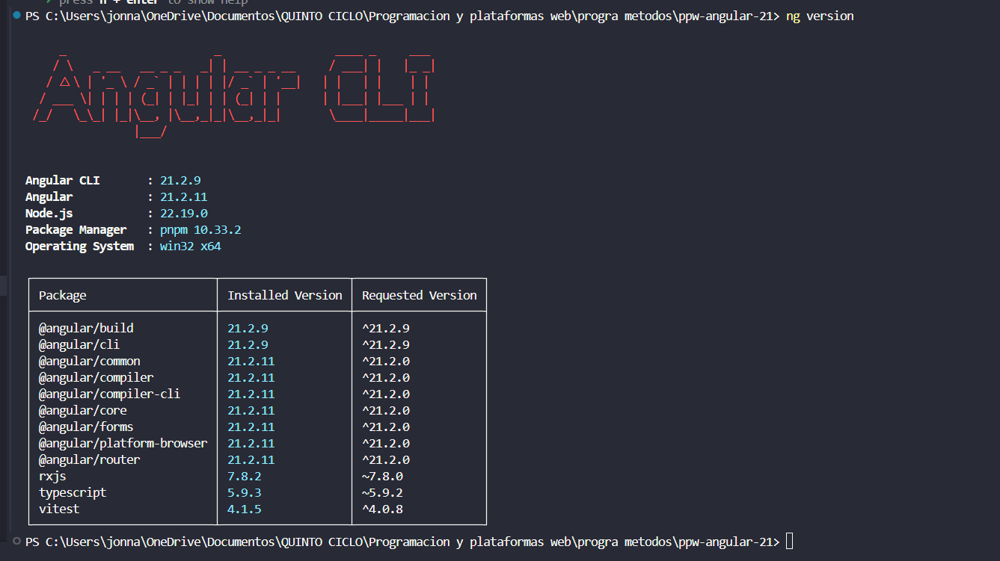
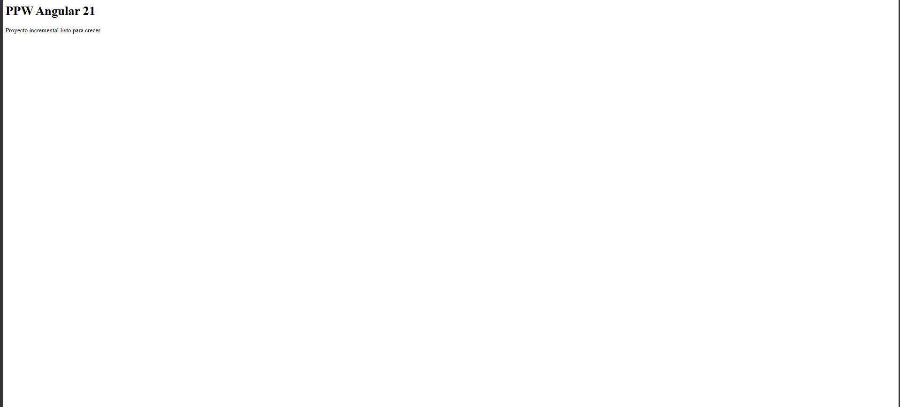

# PPW Angular 21

Proyecto incremental construido con [Angular 21](https://angular.dev/), desarrollado módulo a módulo como parte del curso de Programación y Plataformas Web.

## Propósito

Este proyecto tiene como objetivo aprender y aplicar los fundamentos del framework **Angular 21** mediante la construcción progresiva de una aplicación web. La idea es que la base creada en este módulo crezca de forma ordenada en los módulos siguientes (navegación, formularios, servicios, HTTP, estilos con Tailwind, etc.) sin necesidad de rehacer la estructura.

El estado actual corresponde al **Módulo 01 — Instalación y Configuración del Entorno**, que cubre la creación del proyecto base con Angular CLI, la configuración inicial del enrutamiento y la creación de la primera página dentro de la arquitectura por features.

## Tecnologías utilizadas

- **Angular** v21 — framework principal
- **Angular CLI** v21 — herramienta de scaffolding
- **TypeScript** — lenguaje de desarrollo
- **SCSS** — preprocesador de estilos
- **pnpm** — gestor de paquetes
- **Node.js** v18+ — entorno de ejecución
- **Visual Studio Code** — editor

## Estructura del proyecto

```
ppw-angular-21/
├── src/
│   ├── app/
│   │   ├── features/
│   │   │   └── home/
│   │   │       └── pages/
│   │   │           └── home-page.ts    # Página principal
│   │   ├── app.config.ts                # Configuración global (providers)
│   │   ├── app.routes.ts                # Definición de rutas
│   │   ├── app.ts                       # Componente raíz
│   │   ├── app.html                     # Template del componente raíz
│   │   └── app.scss                     # Estilos del componente raíz
│   ├── styles.scss                      # Estilos globales
│   └── index.html
├── evidencias/
│   └── assets/                          # Capturas del proceso
├── angular.json
├── package.json
├── tsconfig.json
└── README.md
```

La separación en `features/` evita que el proyecto crezca de forma caótica. Cada módulo futuro agregará su propia carpeta dentro de `features/`.

## Comandos disponibles

| Comando         | Acción                                                     |
| :-------------- | :--------------------------------------------------------- |
| `pnpm install`  | Instala las dependencias                                   |
| `pnpm start`    | Inicia el servidor de desarrollo en `localhost:4200`       |
| `pnpm build`    | Compila la aplicación de producción en la carpeta `dist/`  |
| `pnpm test`     | Ejecuta las pruebas unitarias                              |
| `ng version`    | Muestra la versión de Angular CLI y dependencias           |
| `ng generate`   | Genera componentes, servicios, directivas, etc.            |

## Cómo ejecutar el proyecto

1. Clonar el repositorio:
   ```bash
   git clone https://github.com/<tu-usuario>/ppw-angular-21.git
   cd ppw-angular-21
   ```

2. Instalar dependencias:
   ```bash
   pnpm install
   ```

3. Iniciar el servidor de desarrollo:
   ```bash
   pnpm start
   ```

4. Abrir el navegador en [http://localhost:4200](http://localhost:4200)

## Requisitos previos

- Node.js **v18 o superior** (`node --version`)
- pnpm instalado (`pnpm --version`)
- Angular CLI **v21 o superior** (`ng version`)

---

## Evidencias del Módulo 01 — Instalación y Configuración

A continuación se muestran las capturas del proceso de instalación, creación del proyecto y configuración inicial.

### 1. Versión de Angular CLI

Salida del comando `ng version` confirmando que Angular CLI 21 está instalado:



### 2. Creación del proyecto

Proceso de creación del proyecto con Angular CLI usando el comando:

```bash
ng new ppw-angular-21 --routing --style=scss --ssr=false
```


### 3. Página de bienvenida inicial

Página de bienvenida por defecto de Angular en `localhost:4200`, antes de personalizar la aplicación:


### 4. HomePage funcionando

Después de configurar las rutas, simplificar el componente raíz y crear `HomePage` dentro de `features/home/pages/`, la ruta `/` muestra el contenido personalizado:



---

## Validaciones del módulo

- [x] `node --version` retorna 18 o superior
- [x] `pnpm --version` retorna una versión válida
- [x] `ng version` muestra Angular CLI >= 21
- [x] La carpeta `ppw-angular-21/` fue creada con la estructura correcta
- [x] `pnpm start` inicia sin errores de compilación
- [x] `http://localhost:4200` muestra el contenido de `HomePage` (no la página de bienvenida de Angular)
- [x] La ruta `/` renderiza el título "PPW Angular 21"
- [x] Una ruta inexistente redirige a `/`
- [x] No existe `AppModule` en el proyecto (arquitectura standalone)

## Progreso del curso

- [x] Módulo 01 — Instalación y Configuración del Entorno
