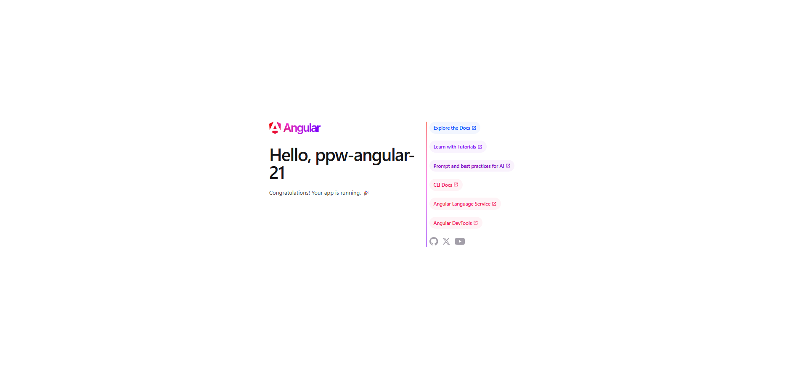
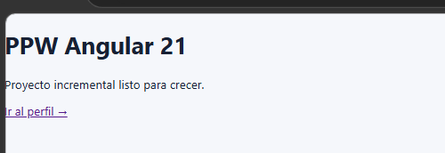
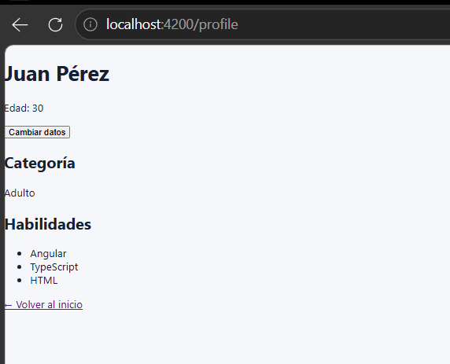
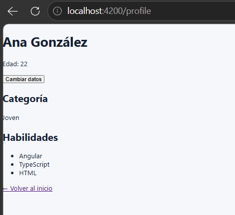

# PPW Angular 21

Proyecto incremental construido con [Angular 21](https://angular.dev/), desarrollado módulo a módulo como parte del curso de Programación y Plataformas Web.

## Propósito

Este proyecto tiene como objetivo aprender y aplicar los fundamentos del framework **Angular 21** mediante la construcción progresiva de una aplicación web. La idea es que la base creada en el primer módulo crezca de forma ordenada en los módulos siguientes (navegación, formularios, servicios, HTTP, estilos con Tailwind, etc.) sin necesidad de rehacer la estructura.

## Tecnologías utilizadas

- **Angular** v21 — framework principal
- **Angular CLI** v21 — herramienta de scaffolding
- **TypeScript** — lenguaje de desarrollo
- **SCSS** — preprocesador de estilos
- **pnpm** — gestor de paquetes
- **Node.js** v18+ — entorno de ejecución
- **Visual Studio Code** — editor

## Estructura del proyecto

```
ppw-angular-21/
├── src/
│   ├── app/
│   │   ├── features/
│   │   │   ├── home/
│   │   │   │   └── pages/
│   │   │   │       ├── home-page.ts
│   │   │   │       └── home-page.html
│   │   │   └── profile/
│   │   │       └── pages/
│   │   │           ├── profile-page.ts
│   │   │           └── profile-page.html
│   │   ├── app.config.ts
│   │   ├── app.routes.ts
│   │   ├── app.ts
│   │   ├── app.html
│   │   └── app.scss
│   ├── styles.scss
│   └── index.html
├── evidencias/
│   └── assets/
├── angular.json
├── package.json
└── README.md
```

La organización por **features** mantiene cada funcionalidad agrupada (componentes, páginas, servicios) en su propia carpeta, evitando que el proyecto crezca de forma caótica.

## Comandos disponibles

| Comando         | Acción                                                     |
| :-------------- | :--------------------------------------------------------- |
| `pnpm install`  | Instala las dependencias                                   |
| `pnpm start`    | Inicia el servidor de desarrollo en `localhost:4200`       |
| `pnpm build`    | Compila la aplicación de producción en `dist/`             |
| `pnpm test`     | Ejecuta las pruebas unitarias                              |
| `ng version`    | Muestra la versión de Angular CLI y dependencias           |

## Cómo ejecutar el proyecto

1. Clonar el repositorio:
   ```bash
   git clone https://github.com/<tu-usuario>/ppw-angular-21.git
   cd ppw-angular-21
   ```

2. Instalar dependencias:
   ```bash
   pnpm install
   ```

3. Iniciar el servidor de desarrollo:
   ```bash
   pnpm start
   ```

4. Abrir el navegador en [http://localhost:4200](http://localhost:4200)

## Requisitos previos

- Node.js **v18 o superior** (`node --version`)
- pnpm instalado (`pnpm --version`)
- Angular CLI **v21 o superior** (`ng version`)

---

## Evidencias del Módulo 01 — Instalación y Configuración

A continuación se muestran las capturas del proceso de instalación, creación del proyecto y configuración inicial.

### 1. Versión de Angular CLI

Salida del comando `ng version`:


### 2. Creación del proyecto

Proceso de creación con `ng new ppw-angular-21 --routing --style=scss --ssr=false`:


### 3. Página de bienvenida inicial

Página de bienvenida por defecto de Angular antes de personalizar:



### 4. HomePage funcionando

`HomePage` cargando desde la ruta `/` después de configurar las rutas:


---

## Evidencias del Módulo 02 — Fundamentos de Angular

Implementación de la feature `profile` para practicar componentes standalone, **signals**, `computed` y el nuevo **control flow** de Angular (`@if`, `@for`, `@switch`).

**Aprendizajes aplicados:**
- Creación de **componentes standalone** sin `NgModule`.
- Manejo de estado reactivo con **signals** (`signal()`, `set()`).
- Valores derivados con **`computed()`** (nombre completo y categoría de edad).
- **Interpolación** leyendo signals como funciones (`{{ fullName() }}`).
- **Event binding** con `(click)` para actualizar el estado.
- **Control flow moderno** (`@if`, `@for`, `@switch`, `@else`, `@default`).
- **Tracking** en bucles con `track skill` para optimización del DOM.
- Navegación entre páginas con **`routerLink`** y nueva ruta `/profile`.

### 1. HomePage con enlace al perfil

Página principal mostrando el enlace de navegación hacia la nueva feature:



### 2. ProfilePage con datos iniciales

`localhost:4200/profile` mostrando los datos iniciales (Juan Pérez, 30 años, categoría "Adulto") y la lista de habilidades renderizada con `@for`:



### 3. ProfilePage después de actualizar el estado

Después de presionar el botón "Cambiar datos", las signals se actualizan y los `computed` reaccionan automáticamente: cambia el nombre completo y la categoría de edad pasa de "Adulto" a "Joven":



---

## Validaciones de los módulos

### Módulo 01
- [x] `node --version` retorna 18 o superior
- [x] `ng version` muestra Angular CLI >= 21
- [x] `pnpm start` inicia sin errores de compilación
- [x] `http://localhost:4200` muestra `HomePage`
- [x] Una ruta inexistente redirige a `/`
- [x] No existe `AppModule` (arquitectura standalone)

### Módulo 02
- [x] La ruta `/profile` renderiza correctamente
- [x] El botón actualiza nombre y edad usando `signal.set()`
- [x] La lista de habilidades se muestra con `@for`
- [x] La categoría cambia automáticamente con `@switch` según la edad
- [x] No se usan `*ngIf` ni `*ngFor` (se usa el control flow moderno)
- [x] Existe enlace de navegación entre `HomePage` y `ProfilePage`

## Progreso del curso

- [x] Módulo 01 — Instalación y Configuración del Entorno
- [x] Módulo 02 — Fundamentos de Angular (signals, computed, control flow)
- [ ] Módulo 03 — (próximamente)

## Autor

Proyecto desarrollado como parte del curso de **Programación y Plataformas Web** — Quinto Ciclo.

## Licencia

Este proyecto se distribuye con fines educativos.