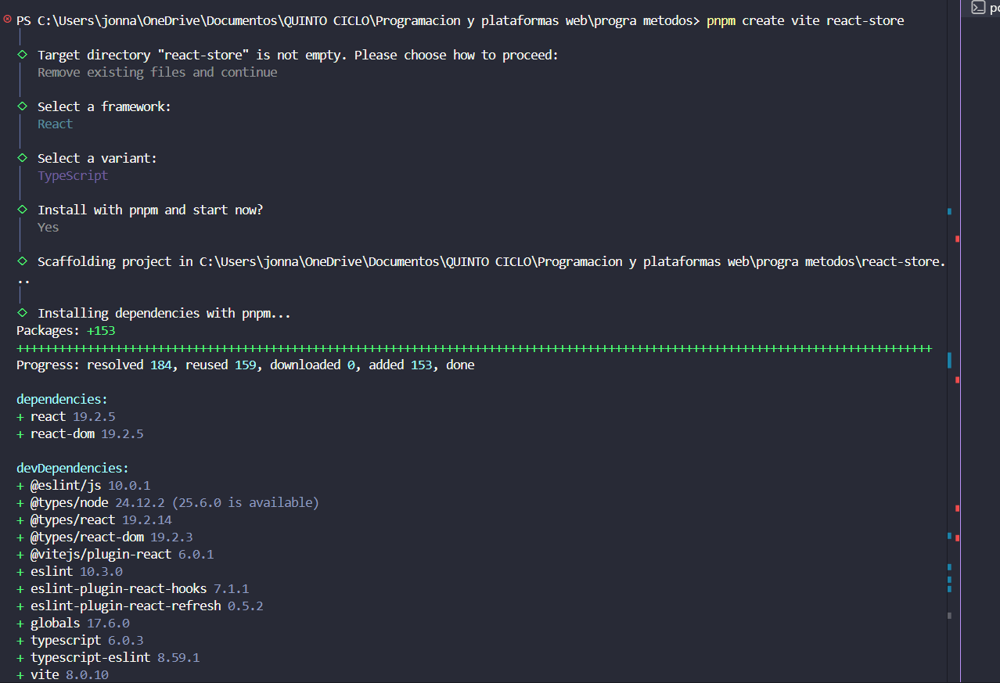
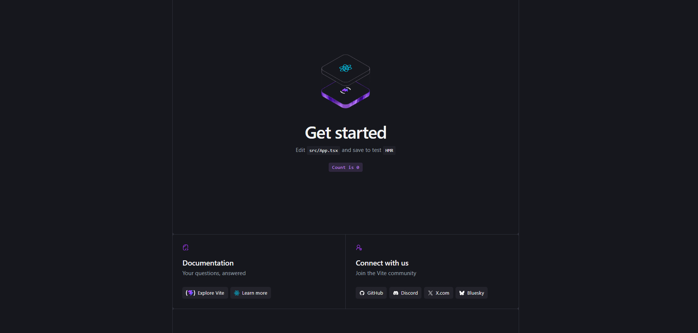
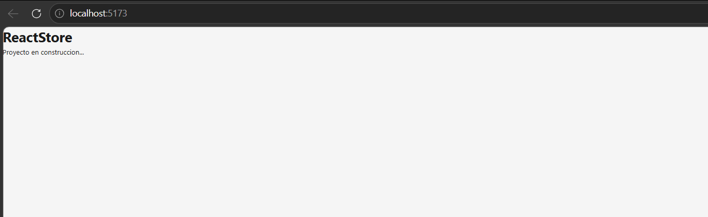

# ReactStore

Tienda de productos construida de forma incremental con [React](https://react.dev/), [TypeScript](https://www.typescriptlang.org/) y [Vite](https://vitejs.dev/), como parte del curso de Programación y Plataformas Web.

## Propósito

Este proyecto tiene como objetivo aprender y aplicar los fundamentos de **React 19** mediante el desarrollo progresivo de una tienda de productos. La idea es que la base configurada en este módulo crezca de forma ordenada en los siguientes módulos (componentes, hooks, enrutamiento, consumo de APIs, manejo de estado, autenticación simulada, etc.) sin necesidad de rehacer la estructura.

El estado actual corresponde al **Módulo 01 — Instalación y Configuración del Entorno**, que cubre la creación del proyecto base con Vite, la configuración de alias de rutas, la limpieza del boilerplate y la primera ejecución local.

**API que se utilizará:** [DummyJSON](https://dummyjson.com/products) — API pública sin necesidad de API key, con endpoints de productos, categorías y autenticación simulada.

## Tecnologías utilizadas

- **React** v19 — biblioteca de interfaces de usuario
- **TypeScript** — lenguaje de desarrollo con tipado estático
- **Vite** — herramienta de scaffolding y servidor de desarrollo
- **pnpm** — gestor de paquetes
- **Node.js** v18+ — entorno de ejecución
- **Visual Studio Code** — editor

## Estructura del proyecto

```
react-store/
├── public/                  # Archivos estáticos
├── src/
│   ├── App.tsx              # Componente raíz
│   ├── App.css              # Estilos del componente raíz
│   ├── main.tsx             # Punto de entrada (monta <App /> en #root)
│   ├── index.css            # Estilos globales
│   └── assets/              # Recursos del componente
├── assets/                  # Capturas de pantalla del proceso
├── index.html               # HTML base de la SPA
├── vite.config.ts           # Configuración de Vite (alias @)
├── tsconfig.app.json        # Configuración de TypeScript (paths)
├── package.json
└── README.md
```

## Configuración aplicada

Se configuró el alias `@` para apuntar a la carpeta `src/`. Esto permite escribir imports más limpios:

```ts
// En lugar de:
import Button from '../../components/Button'

// Se puede usar:
import Button from '@/components/Button'
```

El alias está configurado tanto en `vite.config.ts` (para que funcione en runtime) como en `tsconfig.app.json` (para que TypeScript lo reconozca y autocomplete).

## Comandos disponibles

| Comando         | Acción                                                     |
| :-------------- | :--------------------------------------------------------- |
| `pnpm install`  | Instala las dependencias                                   |
| `pnpm dev`      | Inicia el servidor de desarrollo en `localhost:5173`       |
| `pnpm build`    | Compila la aplicación de producción en la carpeta `dist/`  |
| `pnpm preview`  | Previsualiza el build de producción localmente             |
| `pnpm lint`     | Ejecuta ESLint para verificar el código                    |

## Cómo ejecutar el proyecto

1. Clonar el repositorio:
   ```bash
   git clone https://github.com/<tu-usuario>/react-store.git
   cd react-store
   ```

2. Instalar dependencias:
   ```bash
   pnpm install
   ```

3. Iniciar el servidor de desarrollo:
   ```bash
   pnpm dev
   ```

4. Abrir el navegador en [http://localhost:5173](http://localhost:5173)

## Requisitos previos

- Node.js **v18 o superior** (`node --version`)
- pnpm **v9 o superior** (`pnpm --version`)
- Git instalado (`git --version`)

---

## Evidencias del Módulo 01 — Instalación y Configuración

A continuación se muestran las capturas del proceso de creación del proyecto y configuración inicial.

### 1. Creación del proyecto con Vite

Salida del comando `pnpm create vite react-store` con la selección del template **React + TypeScript**:



### 2. Página de bienvenida de Vite

Servidor de desarrollo corriendo en `localhost:5173` con la página de bienvenida por defecto de Vite + React, antes de limpiar el boilerplate:



### 3. Proyecto limpio funcionando

`localhost:5173` mostrando el componente `App` después de limpiar el boilerplate, con el título de pestaña "ReactStore" y el contenido personalizado:



---

## Validaciones del módulo

- [x] `node --version` retorna 18 o superior
- [x] `pnpm --version` retorna 9 o superior
- [x] La carpeta `react-store/` fue creada con la estructura de Vite + React + TypeScript
- [x] `pnpm dev` inicia sin errores de compilación
- [x] `http://localhost:5173` muestra el componente `App` limpio (no la página de bienvenida de Vite)
- [x] El título de la pestaña del navegador es "ReactStore"
- [x] El alias `@` está configurado en `vite.config.ts` y `tsconfig.app.json`
- [x] No hay errores en la consola del navegador

## Progreso del curso

- [x] Módulo 01 — Instalación y Configuración del Entorno
